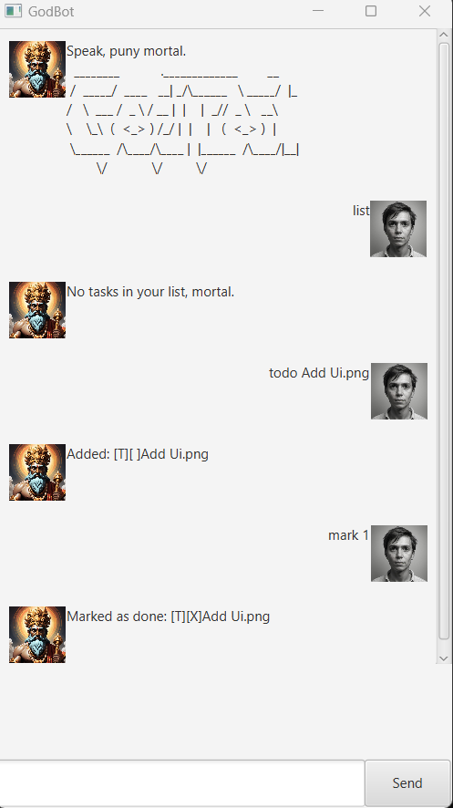

# GodBot User Guide  

## 📸 Product Screenshot  
  

---

## 🔥 Introduction  
**GodBot** is the supreme AI assistant that manages your mundane mortal tasks. It listens to your feeble commands and responds with divine judgment. I named it GodBot after its creator, a God Coder. A+ for Holy Trinity with 2103 on its way, I am a God Coder.  

---

## ✍️ Commands and Usage  

### 📜 Viewing the Task List  
**Command:**  
```sh
list
```
**Expected Output:**  
```sh
1. [T][X] Add Ui.png
2. [E] test (from: 12pm to: 4pm)
3. [E] test2 (from: 12pm to: 8pm)
4. [D] test (by: Feb 02 2001)
```

---

### 📌 Adding a Task  
#### **Adding a ToDo Task**
**Command:**  
```sh
todo <task_name>
```
**Example:**  
```sh
todo Add Ui.png
```
**Expected Output:**  
```sh
Added: [T] [ ] Add Ui.png
```

#### **Adding a Deadline Task**
**Command:**  
```sh
deadline <task_name> /by <YYYY-MM-DD>
```
**Example:**  
```sh
deadline return book /by 2001-02-10
```
**Expected Output:**  
```sh
Added: [D] return book (by: Feb 10 2001)
```

#### **Adding an Event Task**
**Command:**  
```sh
event <task_name> /from <start_time> /to <end_time>
```
**Example:**  
```sh
event test /from 12pm /to 4pm
```
**Expected Output:**  
```sh
Added: [E] test (from: 12pm to: 4pm)
```

---

### ✅ Marking a Task as Done  
**Command:**  
```sh
mark <task_number>
```
**Example:**  
```sh
mark 1
```
**Expected Output:**  
```sh
Marked as done: [T] [X] Add Ui.png
```

---

### ❌ Deleting a Task  
**Command:**  
```sh
delete <task_number>
```
**Example:**  
```sh
delete 4
```
**Expected Output:**  
```sh
Removed: [D] test (by: Feb 02 2001)
```

---

### 🔍 Finding a Task  
**Command:**  
```sh
find <keyword>
```
**Example:**  
```sh
find test
```
**Expected Output:**  
```sh
Here are the matching tasks in your list:
2. [E] test (from: 12pm to: 4pm)
3. [E] test2 (from: 12pm to: 8pm)
```

---

### ⏰ Reminding Tasks  
**Command:**  
```sh
remind
```
**Expected Output:**  
```sh
Here is what you need to do, mortal:
1. [T][X] Add Ui.png
2. [E] test (from: 12pm to: 4pm)
3. [E] test2 (from: 12pm to: 8pm)
4. [D] return book (by: Feb 10 2001)
```

---

## ⚡ Features  

### 📍 Feature: Task Management  
- ✅ Add, delete, and mark tasks.  
- ✅ View tasks in a structured list.  
- ✅ Search tasks by keyword.  

### ⏳ Feature: Deadlines  
- ✅ Add deadline tasks with due dates.  
- ⏳ Upcoming sorting and prioritization (Coming Soon).  

### 🔔 Feature: Reminders  
- ✅ View all pending tasks with a single command.  
- 🔔 Automated notifications (Coming Soon).  

---

## ⚠️ **Warnings for Mortals**  
- ⚡ GodBot only listens to **properly structured** commands.  
- ❌ Disobedience will result in **divine confusion** (invalid command errors).  
